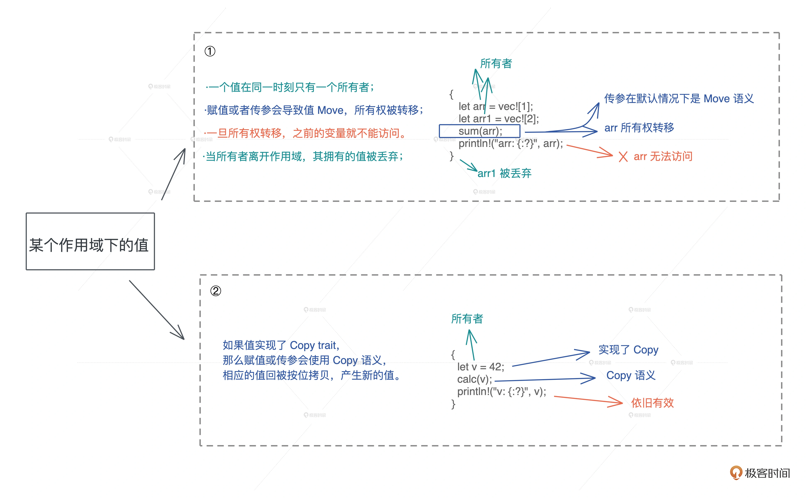
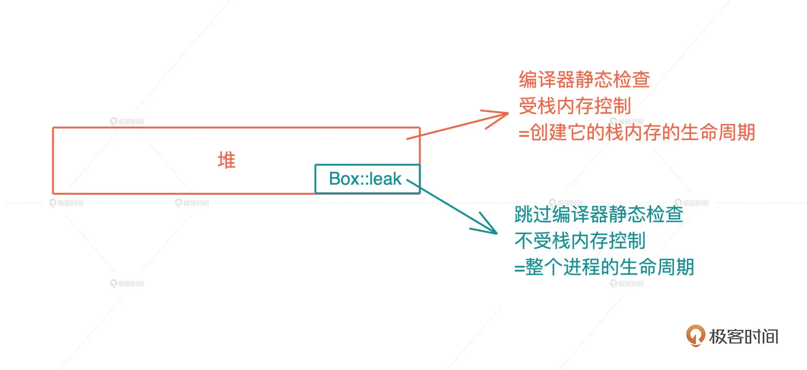
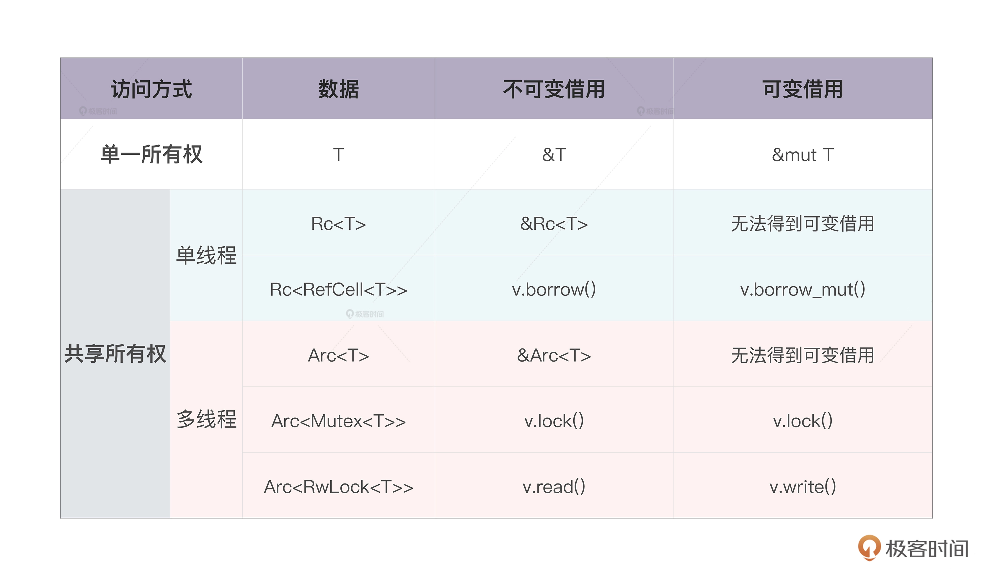

# rust 所有权 相关知识

堆内存引用问题的解决方案:

- c/cpp 手工的内存回收
- java 追踪式 GC
- objc/swift 自动引用计数ARC

**rust 解决思路**

思想: 恰到好处的限制,反而会释放无穷的创意还生产力,如开发框架,react,ruby on rails, 所以rust 决定 限制开发者随意引用的行为-> 限制数据引用的行为.

本质问题是: 数据(值)的生杀大权属于谁管理,这种权利是独享还是共享?

以前的结局思路: 一个值最好只有一个拥有者，因为所有权共享，势必会带来使用和释放上的不明确，走回 追踪式 GC 或者 ARC 的老路.

那么如何保证独占呢？但有太多情况需要考虑。比如说一个变量被赋给另一个变量、作为参数传给另一个函数，或者作为返回值从函数返回，都可能造成这个变量的拥有者不唯一。怎么办？

**rust 所有权 和move 语义**

1. **一个值只能被一个变量所拥有, 这个变量成为所有者(each value in rust has a variable that's called its owner)**
2. **一个值同一个时刻只能有一个所有者(There can only be one owner at a time).**也就是说不能有两个变量拥有相同的值。所以变量赋值、参数传递、函数返回等行为，旧的所有者会把值的所有权转移给新的所有者，以便保证单一所有者的约束。
3. **当所有者离开作用域,其拥有的值被丢弃(when the owner goes out of scope, the value will be dropped)**, 内存得到释放.


*作用域*: 一对花括号括起来的代码块就是一个作用域.

**所有权规则的最大优势:解决了谁真正拥有数据的生杀大权的问题,让堆上数据的多重引用不复存在**

如果不希望所有权被转移:

- copy 语义, 如果一个数据结构实现来copy trait, 那么就会使用copy 语义, 在赋值或者传参时候,值会被自动按位拷贝(浅拷贝)
- 借用数据 (在没有copy 语义实现情况下,可以使用借用数据).


**Copy 语义和 Copy trait**


符合 Copy 语义的类型，赋值或者传参时，值会自动按位拷贝。

换句话说，当要移动一个值，如果值的类型实现了 Copy trait，就会自动使用 Copy 语义进行拷贝，否则使用 Move 语义进行移动。

- 原生类型，包括函数、不可变引用和裸指针实现了 Copy；
- 数组和元组，如果其内部的数据结构实现了 Copy，那么它们也实现了 Copy；
- 可变引用没有实现 Copy；
- 非固定大小的数据结构，没有实现 Copy。

## 小结

- 所有权：一个值只能被一个变量所拥有，且同一时刻只能有一个所有者，当所有者离开作用域，其拥有的值被丢弃，内存得到释放。

- Move 语义：赋值或者传参会导致值 Move，所有权被转移，一旦所有权转移，之前的变量就不能访问。

- Copy 语义：如果值实现了 Copy trait，那么赋值或传参会使用 Copy 语义，相应的值会被按位拷贝（浅拷贝），产生新的值。

核心点：Rust 通过单一所有权来限制任意引用的行为.



### 思考:

在 Rust 下，分配在堆上的数据结构可以引用栈上的数据么？为什么？

答: 只要栈上的数据生命周期大于堆上数据的生命周期就可以, 简单来说就是在堆上数据被回收之前栈上的数据一定会存在的情况下，是可以的. 如何避免悬垂引用?

### 名词

trait 是 Rust 用于定义数据结构行为的接口。如果一个数据结构实现了 Copy trait，那么它在赋值、函数调用以及函数返回时会执行 Copy 语义，值会被按位拷贝一份（浅拷贝），而非移动。


## 所有权: 值 的借用/borrow 语义

当不希望值的所有权被转移，又因为没有实现 Copy trait 而无法使用 Copy 语义，怎么办？ 可以“借用”数据 -> Borrow 语义。

**Borrow 语义**: Borrow 语义允许一个值的所有权，在不发生转移的情况下，被其它上下文使用。Borrow 语义通过引用语法（& 或者 &mut）来实现。

**在 Rust 中，“借用”和“引用”是一个概念**, 

在其他语言中，引用是一种别名，你可以简单理解成鲁迅之于周树人，多个引用拥有对值的无差别的访问权限，本质上是共享了所有权；而在 Rust 下，所有的引用都只是借用了“临时使用权”，它并不破坏值的单一所有权约束。本质上，引用是一个受控的指针，指向某个特定的类型。

**默认情况下，Rust 的借用都是只读的**


**Rust 所有的参数传递都是传值，** 不管是 Copy 还是 Move。所以在 Rust 中，必须显式地把某个数据的引用，传给另一个函数。

Rust 的引用实现了 Copy trait，所以按照 Copy 语义，这个引用会被复制一份交给要调用的函数。对这个函数来说，它并不拥有数据本身，数据只是临时借给它使用，所有权还在原来的拥有者那里。

在 Rust 里，引用是一等公民，和其他数据类型地位相等。

**只读引用实现了 Copy trait，也就意味着引用的赋值、传参都会产生新的浅拷贝。**

## 借用的生命周期及其约束

值的引用的约束：借用不能超过（outlive）值的生存期。一旦 data 离开了作用域被释放，如果还有引用指向 data，会造成使用已释放内存（use after free）这样的内存安全问题,所以引用的生命周期不能超过值的生命周期.

能否在堆内存中使用栈内存的引用?

把一个本地变量的引用存入一个可变数组中:
可变数组存放在堆上，栈上只有一个胖指针指向它
```rust
let mut data = Vec::new();
let v = 42;
data.push(&v);
println!("data: {:?}", data);
```

堆变量的生命周期不具备任意长短的灵活性，因为堆上内存的生死存亡，跟栈上的所有者牢牢绑定。而栈上内存的生命周期，又跟栈的生命周期相关，所以核心只需要关心调用栈的生命周期。

## 可变借用 / 引用

可变借用，在借用的过程中修改值的内容.

多个可变引用共存、可变引用和只读引用共存这两种问题，通过 GC 等自动内存管理方案可以避免第二种，但是第一个问题 GC 也无济于事。

可变引用约束: 

- **在一个作用域内，仅允许一个活跃的可变引用。** 所谓活跃，就是真正被使用来修改数据的可变引用，如果只是定义了，却没有使用或者当作只读引用使用，不算活跃。
- **在一个作用域内，活跃的可变引用（写）和只读引用（读）是互斥的，不能同时存在。**


## 所有权小结

- 一个值在同一时刻只有一个所有者。当所有者离开作用域，其拥有的值会被丢弃。赋值或者传参会导致值 Move，所有权被转移，一旦所有权转移，之前的变量就不能访问。
- 如果值实现了 Copy trait，那么赋值或传参会使用 Copy 语义，相应的值会被按位拷贝，产生新的值。
- 一个值可以有多个只读引用。
- 一个值可以有唯一一个活跃的可变引用。可变引用（写）和只读引用（读）是互斥的关系，就像并发下数据的读写互斥那样。
- 引用的生命周期不能超出值的生命周期。


## 特殊情况，比如 DAG，绕过“一个值只有一个所有者”的限制?


## 智能指针

场景: 

- 在有方向的无环图(DAG)中,某个节点,可能有两个以上的节点指向它, 按照所有权的模型应该如何描述?
- 多个线程要访问同一块共享内存?

在运行时才会遇到的问题,在编译期的静态检查无法处理,所以为了更好的灵活性,**rust 提供来运行时的动态检查,** 来满足特殊的场景需求.

Rust 处理很多问题的思路：**编译时，处理大部分使用场景，保证安全性和效率；运行时，处理无法在编译时处理的场景，会牺牲一部分效率，提高灵活性。**

具体实现方式: 引用计数的智能指针：Rc（Reference counter） 和 Arc（Atomic reference counter）


**Rc（Reference counter）**

对某个数据结构 T，可以创建引用计数 Rc，使其有多个所有者。Rc 会把对应的数据结构创建在堆上(堆是唯一可以让动态创建的数据被到处使用的内存。)

```rust
use std::rc::RC;
fn main() { 
    let a = Rc::new(1);
}
```

如果想对数据创建更多的所有者，可以通过 clone() 来完成。

```rust
use std::rc::Rc;
fn main() {
    let a = Rc::new(1);
    let b = a.clone();
    let c = a.clone();
}
```

**对一个 Rc 结构进行 clone()，不会将其内部的数据复制，只会增加引用计数。**而当一个 Rc 结构离开作用域被 drop() 时，也只会减少其引用计数，直到引用计数为零，才会真正清除对应的内存。

rc clone 的实现:

```rust
fn clone(&self) -> Rc<T> {
    // 增加引用计数
    self.inner().inc_strong();
    // 通过 self.ptr 生成一个新的 Rc 结构
    Self::from_inner(self.ptr)
}
```

那 Rc 是怎么产生在堆上的？并且为什么这段堆内存不受栈内存生命周期的控制呢？

**Box::leak() 机制**

在所有权模型下，堆内存的生命周期，和创建它的栈内存的生命周期保持一致。

所以Rc 是不受所有权管理的.


所以 Rust 必须提供一种机制，让代码可以像 C/C++ 一样，**创建不受栈内存控制的堆内存**，从而绕过编译时的所有权规则。**Rust 提供的方式是 Box::leak()。**

**Box 是 Rust 下的智能指针，它可以强制把任何数据结构创建在堆上，然后在栈上放一个指针指向这个数据结构，但此时堆内存的生命周期仍然是受控的，跟栈上的指针一致。**

Box::leak()，顾名思义，它创建的对象，从堆内存上泄漏出去，不受栈内存控制，是一个自由的、生命周期可以大到和整个进程的生命周期一致的对象. 类似于 C/C++ 下，通过 malloc 分配的每一片堆内存. (最小权限原则（Principle of least privilege），最大程度帮助开发者撰写安全的代码。)



有了 Box::leak()，就可以跳出 Rust 编译器的静态检查，保证 Rc 指向的堆内存，有最大的生命周期，然后再通过引用计数，在合适的时机，结束这段内存的生命周期。

**Rust 所有权的静态检查和动态检查：** 
- 静态检查，靠编译器保证代码符合所有权规则；
- 动态检查，通过 Box::leak 让堆内存拥有不受限的生命周期，然后在运行过程中，通过对引用计数的检查，保证这样的堆内存最终会得到释放。


但是 **Rc 是一个只读的引用计数器**，无法拿到 Rc 结构内部数据的可变引用，来修改这个数据。


**RefCell**

允许在运行时，对某个只读数据进行可变借用.

- 内部可变性: **在编译器的眼里，值是只读的，但是在运行时，这个值可以得到可变借用，从而修改内部的数据，** RefCell 

```rust
use std::cell::RefCell;
fn main() {
    let data = RefCell::new(1);
    {
        // 获得 RefCell 内部数据的可变借用
        let mut v = data.borrow_mut();
        *v += 1;
    }
    println!("data: {:?}", data.borrow());
}
```

- 外部可变性: **用  let mut 显式地声明一个可变的值，或者，用  &mut 声明一个可变引用时，编译器可以在编译时进行严格地检查，保证只有可变的值或者可变的引用，才能修改值内部的数据，这被称作外部可变性（exterior mutability），外部可变性通过 mut 关键字声明。**

## Arc 和 Mutex/RwLock

Rc 为了性能，使用的不是线程安全的引用计数器。因此，需要另一个引用计数的智能指针：Arc，它实现了线程安全的引用计数器。

Arc 内部的引用计数使用了 Atomic Usize ，而非普通的 usize。从名称上也可以感觉出来，Atomic Usize 是 usize 的原子类型，它使用了 CPU 的特殊指令，来保证多线程下的安全。

Rust 实现两套不同的引用计数数据结构，完全是为了性能考虑，如果不用跨线程访问，可以用效率非常高的 Rc；如果要跨线程访问，那么必须用 Arc。

同样的，RefCell 也不是线程安全的，如果要在多线程中，使用内部可变性，Rust 提供了 Mutex 和 RwLock。

Mutex 是互斥量，获得互斥量的线程对数据独占访问，RwLock 是读写锁，获得写锁的线程对数据独占访问，但当没有写锁的时候，允许有多个读锁。读写锁的规则和 Rust 的借用规则非常类似.

Mutex 和 RwLock 都用在多线程环境下，对共享数据访问的保护上。

## 小结

如果想绕过“一个值只有一个所有者”的限制,

可以使用 Rc / Arc 这样带引用计数的智能指针。其中，Rc 效率很高，但只能使用在单线程环境下；Arc 使用了原子结构，效率略低，但可以安全使用在多线程环境下。

然而，Rc / Arc 是不可变的，如果想要修改内部的数据，需要引入内部可变性，在单线程环境下，可以在 Rc 内部使用 RefCell；在多线程环境下，可以使用 Arc 嵌套 Mutex 或者 RwLock 的方法。



